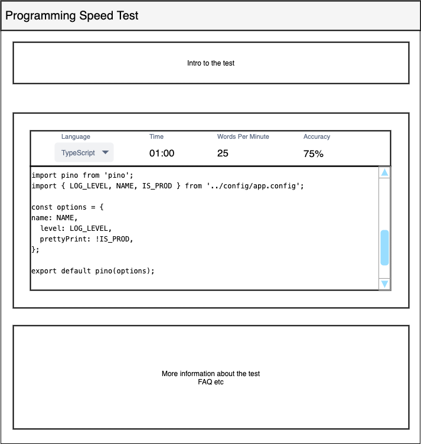

# React Typing Speed

## Problem Definition

One of the main act carried out by a software engineer in their day to day life is typing.
Before they can improve, they first need to **evaluate their proficiency** at typing.

There are currently no test or resources available that provide a way to calculate the CPM (Characters per minute) for writing code. This app will aim to provide exactly that.

## Software requirements

The following section will define the list of functional and non function requirements

### User stories & functional requirements

- As a user, I want to be able to configure the typing test so that it is relevant to me

  1. The user will be view/edit/update the programming language (from list of pre-configured languages)
  2. The user will not be able to alter the selected language while the test is running

- As a user, I want to be able to view the test information as I take the test so I can perform accordingly

  1. If the test is ongoing, the timer will continue to countdown
  2. The WPM & CPM will update based on the amount of words/characters typed by the user

- As a user, I want to be able to take a typing test so that I can find out my proficiency in typing code

  1. The timer for the test will start when the user types in the input field
  2. The correctly typed characters should be green, while incorrectly typed characters should be red
  3. The character being typed should be highlighted
  4. The code snippet display should scroll and ensure the current line stays in focus

- As a user, I want to be able to share my test result on social media so that others know how proficient I am

  1. When the test finishes, provide an option to share the result on social media (platforms to be decided)
  2. User can click on the icon for the relevant platform and it should allow sharing on that platform

- <s>As a user, I want to be able to view my last score so that I can try and improve it</s>

  > Note: Decided to drop this requirement for simplicity

  1. The user score will be cached in local storage
  2. On page load, the last score of the user will be fetched from the local storage and displayed

### Designs

#### Home

## Available Scripts

In the project directory, you can run:

### `yarn start`

Runs the app in the development mode.\
Open [http://localhost:3000](http://localhost:3000) to view it in the browser.

The page will reload if you make edits.\
You will also see any lint errors in the console.

### `yarn test`

Launches the test runner in the interactive watch mode.\
See the section about [running tests](https://facebook.github.io/create-react-app/docs/running-tests) for more information.

### `yarn build`

Builds the app for production to the `build` folder.\
It correctly bundles React in production mode and optimizes the build for the best performance.

The build is minified and the filenames include the hashes.\
Your app is ready to be deployed!

See the section about [deployment](https://facebook.github.io/create-react-app/docs/deployment) for more information.
